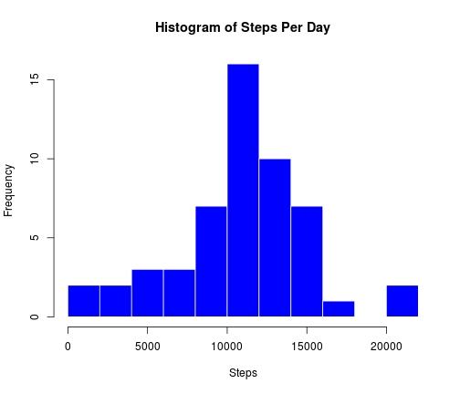
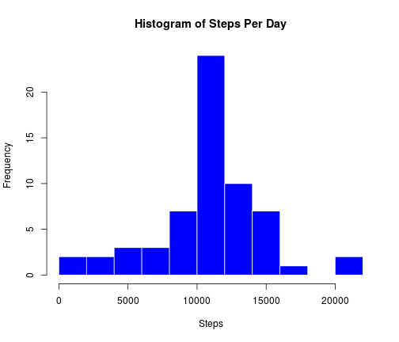
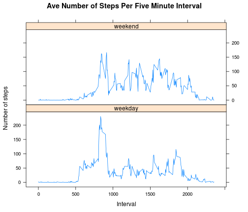

# Reproducible Research: Peer Assessment 1

github repo:  https://github.com/amaner/RepData_PeerAssessment1

## Loading and preprocessing the data
Load the data

```r
dat <- read.csv("activity.csv")
dat$date <- as.character(dat$date)
```
Transform data (if necessary) N/A

## What is mean total number of steps taken per day?
* Make a histogram of the total number of steps taken per day.

To do this, loop over each day (of which there are 61) and add up the steps taken that day (ignoring NAs).

```r
daily.steps <- rep(NA,61)
for (i in 1:61) {
     l = (i-1)*288+1
     u = i*288
     daily.steps[i] <- sum(dat$steps[l:u])
}
```

```r
hist(daily.steps,breaks=15,col="blue",border="white",
     main = "Histogram of Steps Per Day", xlab = "Steps",
     ylab = "Frequency",bg="white")
```

 

* Calculate and report the mean and median total steps taken per day.

```r
mean.steps <- mean(daily.steps, na.rm = TRUE)
median.steps <- median(daily.steps, na.rm = TRUE)
```
The mean number of steps per day is:

```r
mean.steps
```

```
## [1] 10766
```
The median number of steps is:

```r
median.steps
```

```
## [1] 10765
```
## What is the average daily activity pattern?
* Make a time-series plot of the 5-minute interval and the average number of steps taken (averaged across all days).

To do this, first create a 288X61 matrix whose columns contain daily step data, and use it to create a 288 element vector containing the average number of steps per five minute interval, across all days.  Then, glue onto this vector the interval numbers (0 - 2355) and cast it as a data frame.


```r
days <- matrix(0,ncol=61,nrow=288)
for (i in 1:61) {
     l <- (i-1)*288 + 1
     u <- i*288
     days[,i] <- dat$steps[l:u]
}
fivemin.aves <- rep(NA, 288)
for (i in 1:288) {
     fivemin.aves[i] <- mean(days[i,], na.rm=TRUE)
}
fivemin.aves <- as.data.frame(fivemin.aves)
interval <- as.data.frame(dat$interval)
fivemin.aves <- cbind(interval, fivemin.aves)
colnames(fivemin.aves) <- c("interval","aves")
```
Use this data frame of averages to create a time-series plot of the average number of steps taken per five minute interval, averaged across all days.

```r
plot(fivemin.aves$interval,fivemin.aves$aves,type="l",main="Five Minute Interval Step Averages",xlab="Five Minute Interval",ylab="Average Step Count",bg="white")
```

 

* Compute the maximum average number of steps in a five minute interval (over all days), and determine which interval has that maximum value.

```r
max.index <- which.max(fivemin.aves$aves)
max.value <- max(fivemin.aves$aves)
```
The five minute interval having the maximum average number of steps:

```r
fivemin.aves$interval[max.index]
```

```
## [1] 835
```
This corresponds to the time interval between 8:35AM and 8:40AM.

The maximum average number of steps:

```r
max.value
```

```
## [1] 206.2
```
## Imputing missing values
* Compute and report the number of rows (in the original data set) containing missing values (NA).

```r
nas <- complete.cases(dat)
table(nas)
```

```
## nas
## FALSE  TRUE 
##  2304 15264
```
There are 2304 incomplete cases (rows containing NAs).

* Devise a strategy for for filling in all missing values in the dataset.

I chose to replace each five minute interval NA value with the average number of steps taken in that interval, averaged across all 61 days.

* Create a new dataset equivalent to the original dataset, with all NA values replaced according to the above strategy.


```r
tmp <- dat
tmp$na <- is.na(tmp$steps)
for (i in 1:61) {
     l <- (i-1)*288+1
     u <- i*288
     for (j in l:u) {
          if (tmp$na[j] == TRUE & j%%288 == 0) {
               tmp$steps[j] <- fivemin.aves$aves[288]
          }
          if (tmp$na[j] == TRUE & j%%288 != 0) {
               tmp$steps[j] <- fivemin.aves$aves[j%%288]
          }
     }
}
dat$steps <- tmp$steps
```

The dat data frame now contains no NA values, as can be seen here:

```r
test <- is.na(dat$steps)
table(test)
```

```
## test
## FALSE 
## 17568
```

* Make a histogram of the total number of steps per day, using this new data frame, and report the mean and median number of steps taken per day.


```r
new.daily.steps <- rep(NA,61)
for (i in 1:61) {
     l = (i-1)*288+1
     u = i*288
     new.daily.steps[i] <- sum(dat$steps[l:u])
}
new.mean.steps <- mean(new.daily.steps, na.rm = TRUE)
new.median.steps <- median(new.daily.steps, na.rm = TRUE)
```


```r
hist(new.daily.steps,breaks=15,col="blue",border="white",
     main = "Histogram of Steps Per Day", xlab = "Steps",
     ylab = "Frequency")
```

 

The new mean number of steps per day is:

```r
new.mean.steps
```

```
## [1] 10766
```

The new median number of steps per day is:

```r
new.median.steps
```

```
## [1] 10766
```

* Do these values differ from those computed in the first part of the assignment?

The mean is unchanged, while the median increased by one unit (and now equals the mean).

* What is the impact of imputing missing data on the estimates of the total number of steps?

Using the method I chose, the effect on the estimators (mean and median) is very minor (change of 0 and 1, respectively).  The impact on the daily total steps vector is as follows:some days (those that had all NAs in the steps variable) now report 10766 as the total (the mean), while others (those that had some NAs in the steps variable) now report numbers larger than they previously did.  Overall, though, the impact was minimal.
## Are there differences in activity patterns between weekdays and weekends?

* Create a new factor variable with two levels - "weekday" and "weekend" - indicating whether a given day is a weekday or a weekend day.


```r
dat$date <- as.Date(dat$date)
dat$day  <- weekdays(dat$date)
dat$wday <- rep("", length(dat$steps))
for (i in 1:length(dat$wday)) {
     if (dat$day[i] == "Saturday" | dat$day[i] == "Sunday") {
          dat$wday[i] = "weekend"
     }
     else {
          dat$wday[i] = "weekday"
     }
}
dat$wday <- as.factor(dat$wday)
class(dat$wday)
```

```
## [1] "factor"
```

* Make a panel plot showing average number of steps taken per five minute interval, averaged across weekday days or weekend days.


```r
weekday <- subset(dat,dat$wday=="weekday")
weekend <- subset(dat,dat$wday=="weekend")
numwkdays <- length(weekday$steps)/288
numwkends <- length(weekend$steps)/288
tmpweek  <- matrix(0,ncol=numwkdays,nrow=288)
tmpwkend <- matrix(0,ncol=numwkends,nrow=288)
for (i in 1:numwkdays) {
     l <- (i-1)*288+1
     u <- i*288
     tmpweek[,i] <- weekday$steps[l:u]
}
for (i in 1:numwkends) {
     l <- (i-1)*288+1
     u <- i*288
     tmpwkend[,i] <- weekend$steps[l:u]
}
wkaves <- rep(0,288)
wkendaves <- rep(0,288)
for (i in 1:288) {
     wkaves[i] <- mean(tmpweek[i,])
     wkendaves[i] <- mean(tmpwkend[i,])
}
rm(weekend,weekday,tmpweek,tmpwkend)
wkaves <- as.data.frame(wkaves)
colnames(wkaves) <- "aves"
wkendaves <- as.data.frame(wkendaves)
colnames(wkendaves) <- "aves"
newfivemin.aves <- as.data.frame(dat$interval[1:576])
colnames(newfivemin.aves) <- "interval"
allaves <- as.data.frame(rbind(wkaves,wkendaves))
newfivemin.aves <- cbind(newfivemin.aves,allaves)
newfivemin.aves$wday <- rep("",576)
for (i in 1:288) newfivemin.aves$wday[i] <- "weekday"
for (i in 289:576) newfivemin.aves$wday[i] <- "weekend"
newfivemin.aves$wday <- as.factor(newfivemin.aves$wday)
```

```r
library(lattice)
xyplot(aves ~ interval | wday, type = "l", data = newfivemin.aves, layout = c(1,2), xlab = "Interval", ylab = "Number of steps", main = "Ave Number of Steps Per Five Minute Interval")
```

 

As can be seen in the chart above, the subject is generally more active on weekend days than on weekday days, despite the fact that he/she has a spike in activity around 8:30AM on typical weekday days.
